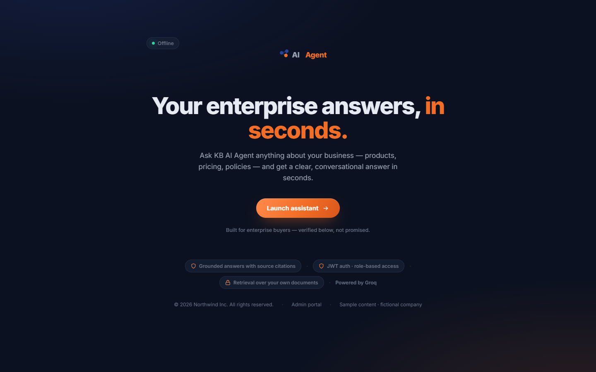
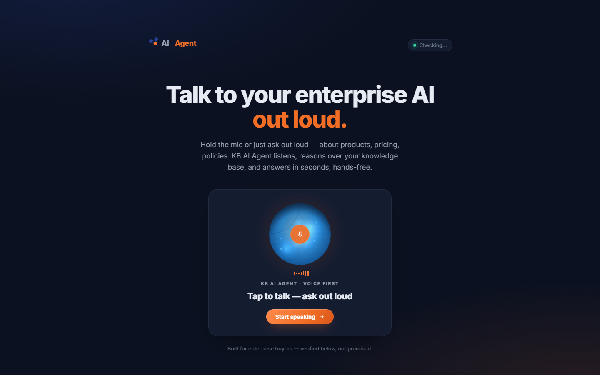
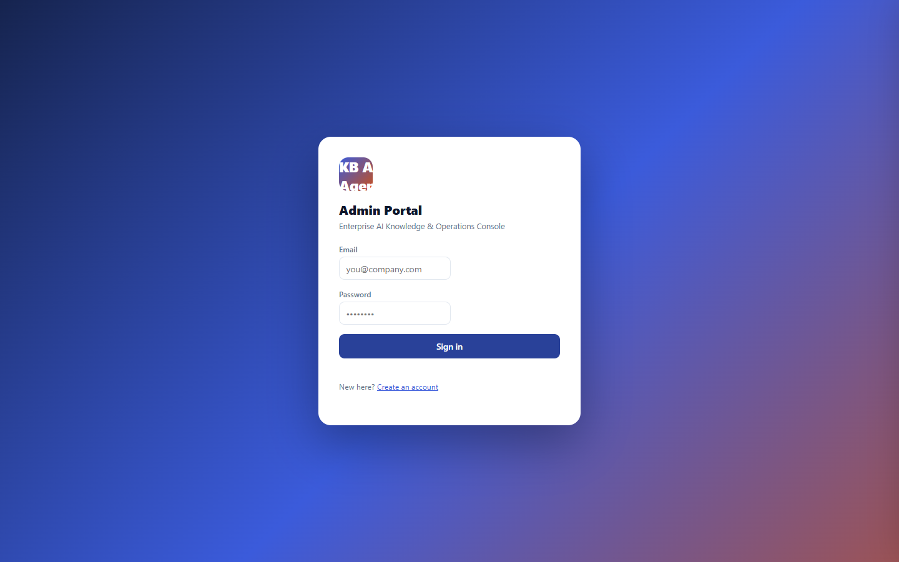

# Enterprise AI Agent

A self-hosted AI assistant that answers questions from your own documents, cites the
source it used, and says so when it cannot find a reliable answer.

## The problem

Most AI chat demos are a prompt plus a vector database. The hard parts only show up
once real users and real documents arrive:

- **Stale answers.** Documents change. Without incremental re-indexing, the bot
  confidently answers from last quarter's pricing page.
- **Untraceable answers.** A plausible-sounding answer with no source is worse than
  no answer, because nobody can check it.
- **Routing.** One general assistant handles billing questions and technical questions
  equally badly. Specialists answer their own domain properly.
- **Operational cost.** Naive retrieval runs several model calls per message whether
  or not the question needs them.

This platform addresses each of those: content-hash based incremental ingest,
mandatory citations, an optional supervisor that routes to domain specialists, and a
record of every routing decision.

## Status

Working and containerised. Single-tenant in practice, multi-tenant-ready in the
schema. The knowledge base ingests uploaded documents and can crawl a configured
site.

**Not done yet:** production deployment is not configured. The free-tier hosting
blueprints spin down after inactivity and delete their database after 30 days — they
are for demos only. Raise the service and database plans before putting real
customers on it.

## Architecture

```
  Browser
    |   chat UI (index.html, main.html)      admin portal (admin-ai.html)
    |   SSE  +  WebSocket
    v
  FastAPI  --------------------------------  JWT auth, RBAC, rate limits
    |
    +-- orchestrator
    |     +-- single-agent tool loop          (default)
    |     +-- LangGraph supervisor            (opt-in, USE_LANGGRAPH=true)
    |              +-- knowledge specialist
    |              +-- support specialist
    |              +-- sales specialist
    |
    +-- search_knowledge_base
    |        hybrid retrieval: Postgres full-text ts_rank  +  pgvector cosine
    |
    +-- PostgreSQL 16  (+ pgvector)
           tenants / users / conversations / document_chunks.embedding
```

Both retrieval paths run against the same tenant-scoped table. Keyword search uses
Postgres full-text ranking, vector search uses cosine distance over `pgvector`.
Embeddings come from Ollama locally or any OpenAI-compatible endpoint.

## Tech stack

| Layer | Technology |
| --- | --- |
| API | FastAPI, SQLAlchemy (async), Alembic, Uvicorn |
| Agent routing | LangGraph `StateGraph` supervisor + specialist workers |
| Retrieval | pgvector cosine, Postgres full-text `ts_rank`, hybrid weighting |
| LLM | Groq or Anthropic; any OpenAI-compatible endpoint also works |
| Embeddings | Ollama locally, or any OpenAI-compatible embeddings endpoint |
| Auth | JWT access + refresh, Argon2 password hashing, owner/admin/editor/viewer roles |
| Streaming | Server-Sent Events and WebSocket |
| Frontend | Static HTML/JS chat UI and admin portal; React + Vite web component widget |
| Database | PostgreSQL 16 with the `vector` extension |
| Infra | Docker, Docker Compose |

## Running it

```bash
git clone https://github.com/jeevithkumarjt/ai-agent.git
cd ai-agent

cp .env.example .env
# Set JWT_SECRET to 32+ random characters.
# Set ANTHROPIC_API_KEY to a Groq (gsk_...) or Anthropic (sk-ant-...) key.
# Set EMBEDDINGS_API_KEY if you want real RAG (see .env.example for Ollama).

docker compose up -d --build
```

That brings up Postgres with `pgvector` and the API. Migrations and the owner
account are applied automatically on boot.

| Service | URL |
| --- | --- |
| Chat UI | http://localhost:8080/ |
| Admin portal | http://localhost:8080/admin-ai.html |
| API docs | http://localhost:8080/docs |

Then load some knowledge:

```bash
docker compose exec backend python -m backend.cli ingest --path ./documents
```

`documents/` ships with three Markdown files about a fictional company, so the
pipeline can be exercised without anyone else's material. Drop your own files in
there and ingest them the same way.

### Run it without Docker

Bring your own Postgres with the `vector` extension, then:

```bash
pip install -e "./backend[dev]"
alembic -c backend/alembic.ini upgrade head
python -m backend.cli seed
uvicorn backend.main:app --reload
```

### Embeddable widget

```bash
cd frontend && npm install && npm run build    # -> dist/agent-widget.js
```

```html
<script type="module" src="/agent-widget.js"></script>
<ai-agent-widget api-base="http://localhost:8080"></ai-agent-widget>
```

### Multi-agent mode

Off by default, because each turn then costs a supervisor call plus up to two worker
calls. Turn it on in `.env`:

```bash
USE_LANGGRAPH=true
```

## Screenshots

| | |
| --- | --- |
| **Landing page** |  |
| **Chat UI** |  |
| **Admin portal** |  |

## Configuration

Every key is documented in `.env.example`. The ones that matter:

| Key | Purpose |
| --- | --- |
| `DATABASE_URL` | Postgres DSN |
| `JWT_SECRET` | 32+ character random string |
| `LLM_PROVIDER` | `groq` or `anthropic` |
| `ANTHROPIC_API_KEY` | Groq (`gsk_...`) or Anthropic (`sk-ant-...`) key |
| `EMBEDDINGS_API_KEY` | OpenAI-compatible embeddings key. Unset disables retrieval |
| `KNOWLEDGE_SITES` | Comma-separated URLs to crawl into the knowledge base |
| `USE_LANGGRAPH` | `true` enables the multi-agent supervisor |

## Security

- Secrets come from the environment only. No `.env` file is committed, and
  `.env.example` holds placeholders rather than working credentials.
- Passwords are stored as Argon2 hashes.
- JWT access tokens last 30 minutes, refresh tokens 14 days. Both carry `tenant_id`
  and `role`.
- Role changes and deactivation take effect immediately — roles resolve from the
  database, not from the token alone.
- Public chat visitors get a viewer-scoped token with per-IP and per-visitor rate
  limits. No admin credentials ever reach the browser.

## Documentation

- `01-architecture-decisions.md` — why each major decision went the way it did
- `02-agent-and-rag-workflow.md` — the request path through the agent
- `03-data-model.md` — schema and relationships
- `04-api-contract.md` — endpoint reference
- `05-roadmap.md` — what is planned
- `06-system-overview.md` — a map of the whole system
- `api/openapi.yaml` — machine-readable API contract

## License

[MIT](LICENSE)
