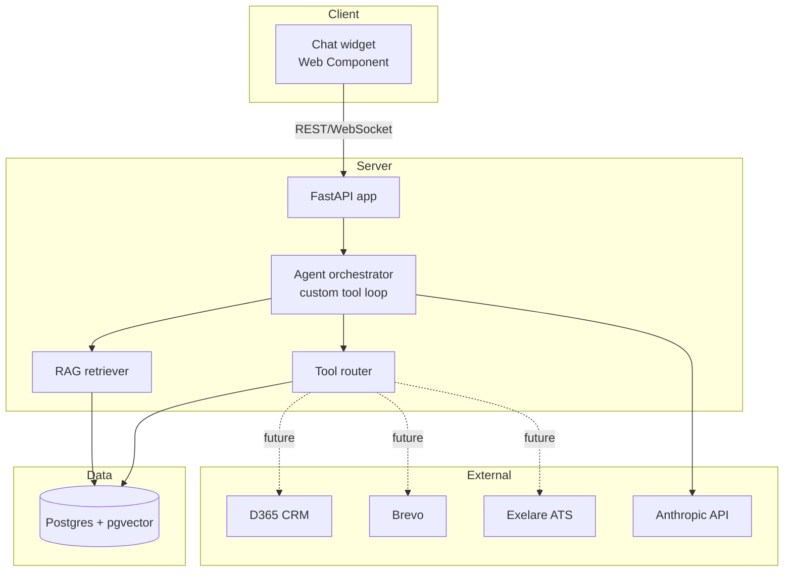

# Architecture Decisions

**Status: Locked.** This is the single source of truth. No component gets added, swapped, or "just
tried quickly" without updating this document first. If a decision must change, add a new ADR entry —
never silently deviate.

## 1. System overview

A single-tenant-today, multi-tenant-ready AI agent platform. Local-first development, deployable
later without a rebuild. One relational database does double duty as the vector store. One backend
process owns orchestration, RAG, and tool execution. Frontend is a framework-agnostic embeddable
widget from day one.

## 2. ADR log

### ADR-001: Single database for relational + vector data
**Decision:** Postgres with the `pgvector` extension. No separate Chroma/Pinecone/etc.
**Context:** The system needs conversation history, users, tenants, and vector embeddings. Running
two databases for an MVP is unjustified operational surface.
**Consequence:** Vector search is not approximate-nearest-neighbor-optimized out of the box.
Acceptable until >10M vectors or measured latency problems — only then is a dedicated vector store
justified.

### ADR-002: Custom tool-calling loop, not LangGraph/LangChain
**Decision:** Hand-written orchestration loop using Anthropic's native `tool_use` blocks.
**Context:** Fewer than 10 tools. A framework's abstraction cost exceeds its benefit at this scale.
**Consequence:** ~150–250 lines of orchestration code owned and understood in full. Revisit only if
tool count or branching complexity grows past what a linear loop can express clearly.

### ADR-003: Frontend ships as a Web Component
**Decision:** Build with React internally, compile to a single-file Web Component (Vite +
`@vitejs/plugin-react` in library mode, or Lit if React overhead isn't needed).
**Context:** The widget must eventually embed on external client sites via a script tag,
framework-agnostic. Retrofitting this after building a plain React SPA is a full rebuild of the
entry point and state boundary.
**Consequence:** Slightly more build config now. Zero rework later.

### ADR-004: Tenant scoping from day one
**Decision:** Every table that holds tenant-owned data carries a `tenant_id` column, foreign-keyed
to a `tenants` table, even with exactly one row in that table today.
**Context:** Multi-tenancy retrofits onto a single-tenant schema are the most common rebuild in
systems like this.
**Consequence:** Every query filters by `tenant_id`. No query is ever written to scan across
tenants by accident.

### ADR-005: JWT with tenant claim, not server-side sessions
**Decision:** Stateless JWT, `tenant_id` embedded as a claim, validated on every request.
**Context:** Enables horizontal scaling of the API layer without a shared session store. Matches the
tenant-scoping decision above.
**Consequence:** Token revocation requires a short-lived token + refresh strategy, not a session
blacklist. Refresh flow ships in phase 1.

### ADR-006: Structured JSON logging from the first commit
**Decision:** All logs emitted as structured JSON (`structlog`), never bare `print()`.
**Context:** Trivial to pipe into any log aggregator later. Retrofitting structured logging into a
codebase full of `print()` calls is tedious and gets skipped.
**Consequence:** Marginally more verbose logging calls now.

### ADR-007: Secrets via environment variables only, never hardcoded
**Decision:** All credentials (LLM API key, DB connection string, future CRM/email API keys) read
from environment variables via `pydantic-settings`. `.env` for local dev, real secrets manager for
deployment — same code path either way.
**Consequence:** Zero secrets in git history, zero code changes when moving to a secrets manager.

### ADR-008: Rate limiting stubbed, not built
**Decision:** A no-op middleware placeholder sits in the request pipeline at the correct position.
No actual limiting logic yet.
**Context:** Not needed for local/single-user dev. The seam matters more than the implementation
right now.

## 3. Deployment path (not built now, seams left in place)

Local dev today: `docker-compose.yml` with two services — `postgres` (with pgvector image) and the
FastAPI app run via `uvicorn --reload`. Frontend runs via `vite dev` separately, pointed at
`localhost:8000`.

When a real deployment target exists: same containers, no code changes, because ADR-006 and
ADR-007 already made the app environment-agnostic. This is deliberately the only deployment
guidance in this document — anything more is designing for infrastructure that doesn't exist yet.

## 4. Explicitly out of scope right now

Kubernetes, CI/CD pipelines, monitoring dashboards, rate limiting implementation, multi-region,
SSO/SAML. Each has a seam already in place (§2) so adding them later is additive, not a rebuild.
