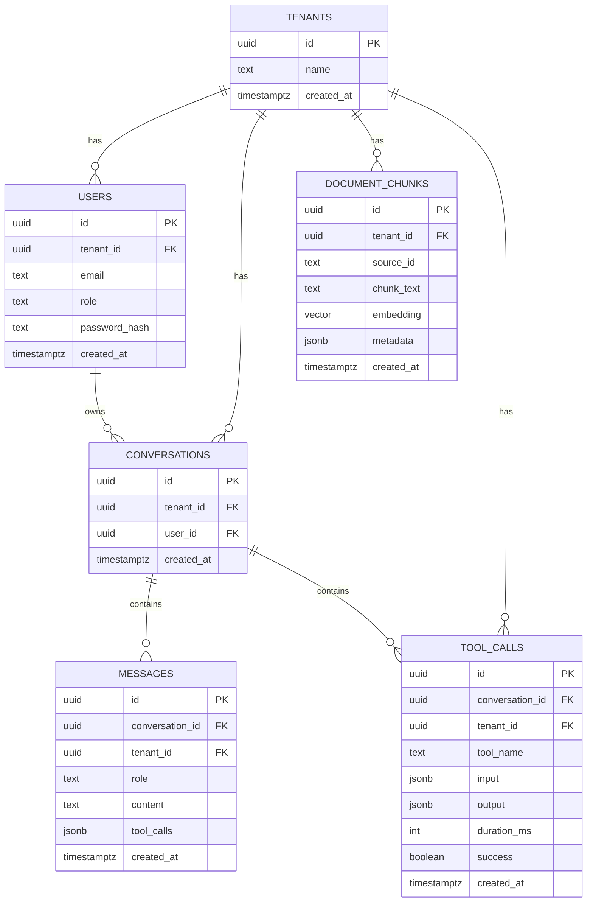

# Data Model

**Status: Locked.** Abbreviated here; the full DDL is the single source of truth at
`database/schema.sql`.

Every table that holds tenant-owned data carries a `tenant_id` column, foreign-keyed to `tenants`
(ADR-004). Every query filters by `tenant_id`.

## 1. Tables

| Table | Key columns | Notes |
|---|---|---|
| `tenants` | `id, name, created_at` | One row today, schema ready for more |
| `users` | `id, tenant_id, email, role` | Auth subjects; password hash stored on user |
| `conversations` | `id, tenant_id, user_id, created_at` | One per chat session |
| `messages` | `id, conversation_id, tenant_id, role, content, created_at` | Full history; role = user/assistant/tool |
| `document_chunks` | `id, tenant_id, source_id, chunk_text, embedding vector(1536), metadata jsonb` | RAG store |
| `tool_calls` | `id, conversation_id, tenant_id, tool_name, input jsonb, output jsonb, duration_ms, success` | Audit log, doubles as debugging trace |

## 2. Indexes

- `tenant_id` on every table — composite with the primary lookup column where one exists.
- `ivfflat` index on `document_chunks.embedding` — **skipped for MVP row counts**; flat scan is
  fine under ~50k rows (ADR-001). The index DDL is commented in `database/schema.sql` and can be
  enabled when row counts justify it.

## 3. ER diagram

The `messages.tool_calls` column mirrors the tool_use blocks exchanged with the LLM so the LLM
conversation can be reconstructed verbatim from history.
