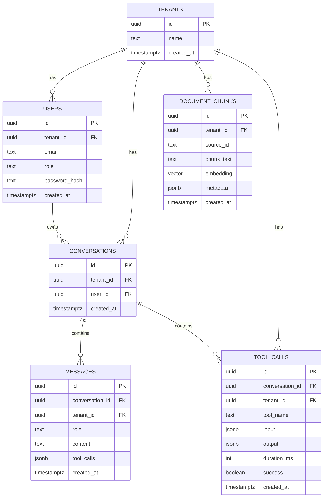

# ER Diagram

**Status: Locked.** Companion to `03-data-model.md`; full DDL in `database/schema.sql`.

Notes:

- `users` has a unique constraint on `(tenant_id, email)`.
- `document_chunks.embedding` is `vector(1536)`; similarity uses cosine distance (`<=>`).
- The `ivfflat` index is intentionally deferred (ADR-001) — flat scan is fine under ~50k rows.
